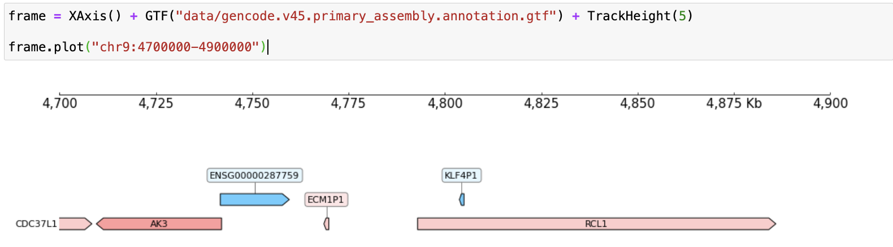
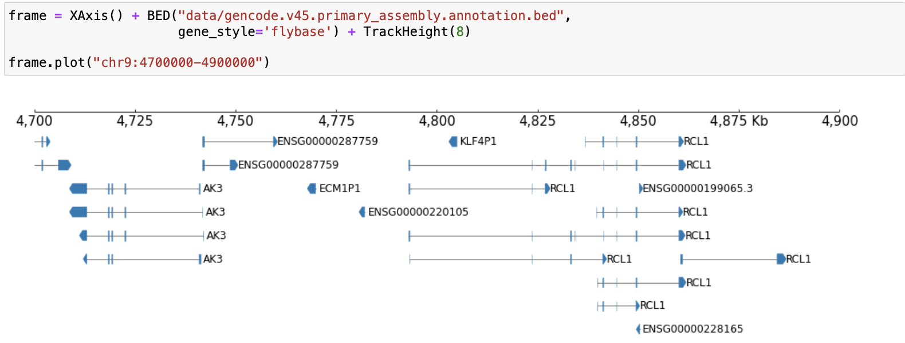

# gtf2bed
 
gtf2bed is a Python-based utility for converting GTF files to BED12 format, specifically designed to handle Gencode GTF files. This tool ensures compatibility with genome visualization tools like CoolBox by addressing limitations in standard GTF-to-BED converters. Unlike standard tools (like [gtf2bed from bedops](https://bedops.readthedocs.io/en/latest/content/reference/file-management/conversion/gtf2bed.html)), gtf2bed consolidates multi-line GTF entries into a single transcript-per-line BED12 format, supporting block structures that represent exon regions. It also correcly handled the feature column which isn't normally processed correctly.

## Key Features
- **Multi-line to Single-line Conversion:** Aggregates multi-line GTF entries (one per feature) into a single line per transcript, with multiple blocks as needed.
- **Gencode Compatibility:** Written to handle the tag-value pairs in Gencode’s attribute column, ensuring comprehensive information in the converted BED format.
- **Visualization-ready Output:** Generates BED12 files compatible with CoolBox and similar genome visualization tools

## Installation

### requirements

- python3 with pandas and tqdm
- bash with sort/awk (any unix/linux machine)

### install

Clone the repository:

```
git clone https://github.com/yourusername/gtf2bed.git
cd gtf2bed
```

## Usage
Run gtf2bed with the following command, specifying the GTF input file and the desired BED output:

```
./gtf2bed.sh path/to/input.gtf
```

## Example

```
./gtf2bed.sh gencode.v45.annotation.gtf
```

This will produce a BED12 file ready for use in genome visualization tools. Using Coolbox, whole gene images from the gencode gtf file, like this:



Can now be used to show block-level (exon) information, like this:



See ./examples for example input/output files.

## License
This project is licensed under the MIT License.

## Notes

gtf2bed is limited in that:

- It groups by transcripts and then keeps names from gene_name, else gene_id, else transcript_id if missing, so other features/names may be lost, though I have not seen any issues arise from this yet
- It doesn't yet support keeping other column information from the gtf file as additional columns (BED12+ format)
- Output can be checked to make sure it's a valid BED file using [bedops](https://bedops.readthedocs.io/en/latest/index.html) (after installing it) by running `bedops --ec --everything your_output_file.bed 1> /dev/null` which will print issues if there are any

## Related

See:

- [Coolbox](https://gangcaolab.github.io/CoolBox/index.html)
- [Gencode files](https://ftp.ebi.ac.uk/pub/databases/gencode/Gencode_human/release_45/)
- [The GTF format](https://useast.ensembl.org/info/website/upload/gff.html)
- [The BED12 format](https://bedtools.readthedocs.io/en/latest/content/general-usage.html)
